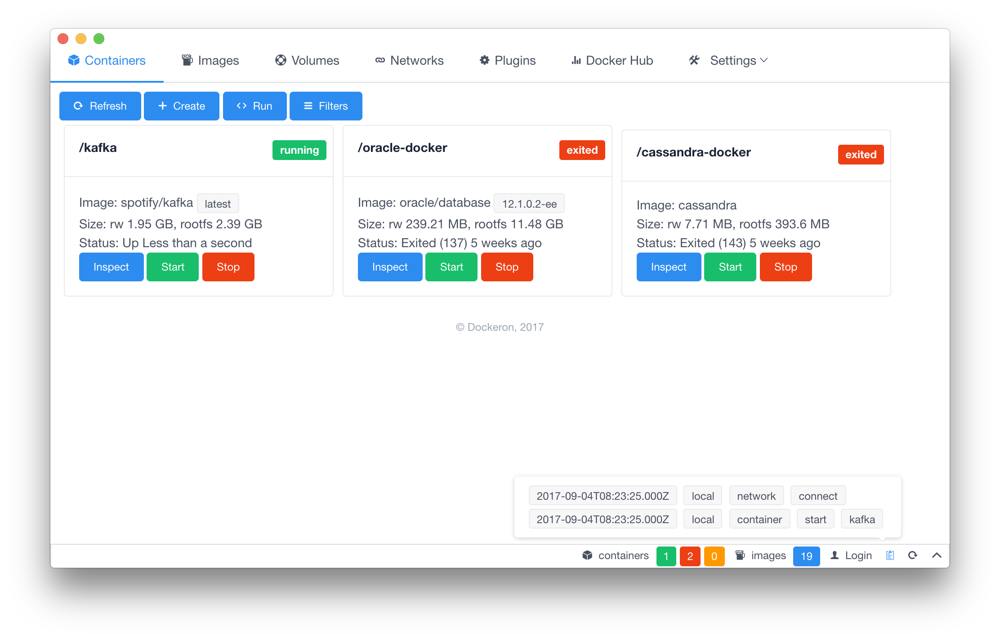
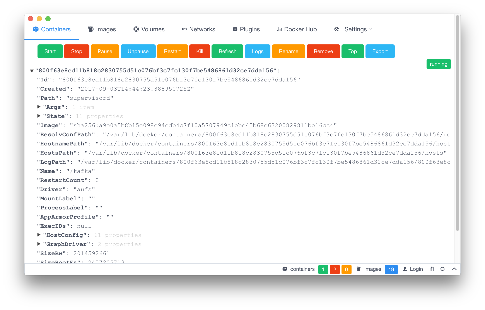
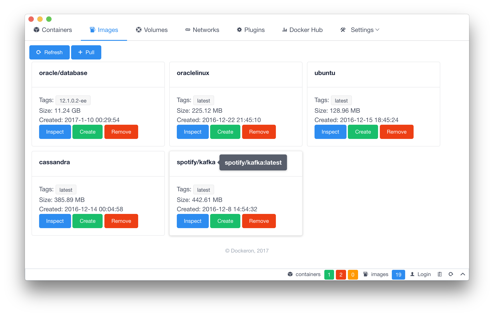
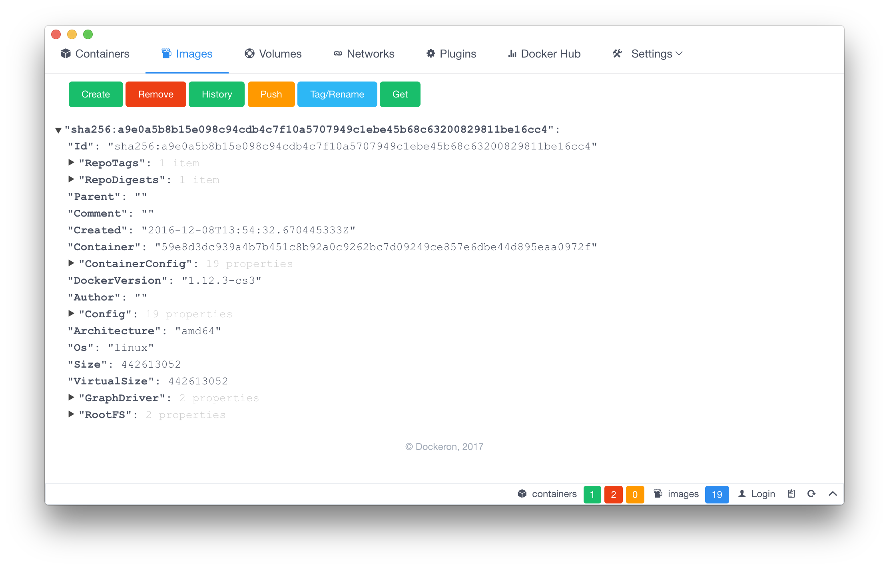
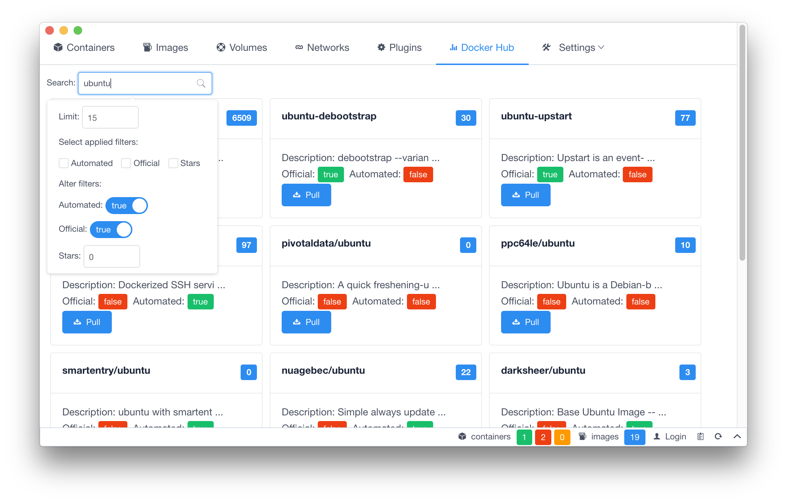
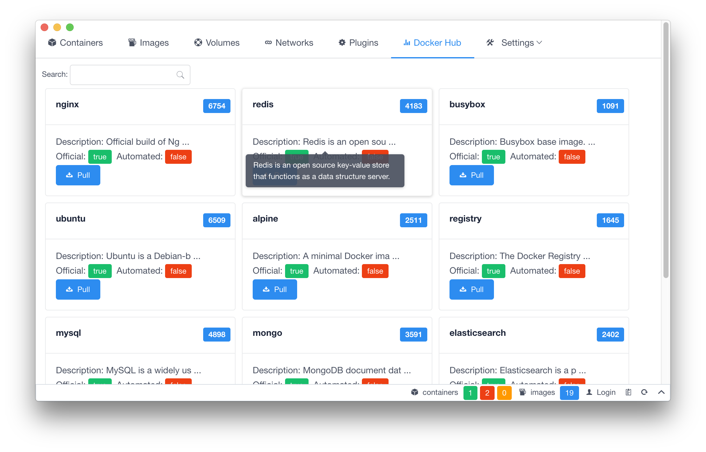

[](https://travis-ci.org/dockeron/dockeron)
[](https://ci.appveyor.com/project/fluency03/dockeron)
[](https://github.com/dockeron/dockeron/tags)
[](https://github.com/dockeron/dockeron/releases)
[](https://www.npmjs.com/package/dockeron)
[](https://www.npmjs.com/package/dockeron)
[](https://opensource.org/licenses/MIT)
[](https://gitter.im/dockeron-project)
[](https://github.com/dockeron/dockeron)

[](https://github.com/feross/standard)

dockeron 项目, 利用 Electron + Vue.js 为 Docker 构建一个客户端.
  - 模板生成: [electron-vue](https://github.com/SimulatedGREG/electron-vue)
  - Docker Engine API: [dockerode](https://github.com/apocas/dockerode).
  - UI 组件: [iView](https://github.com/iview/iview)

*注意: 这个项目还在一直在进行开发, 许多功能特性还没有实现, 一些地方还是有功能性的bug.*

欢迎提 PR 和 [issues](https://github.com/dockeron/dockeron/issues/new).


## 开发

首先确定你你已经成功安装 Node.js (建议安装 node@^6.5.0 或者更高的版本 ).

- 克隆项目文件到你的机器上
```
git clone git@github.com:jjeejj/electron-docker.git
cd electron-docker
```

- 新建功能分支或者bug分支，并切换

- 安装依赖，并运行服务

```
npm install
npm run dev
```

## 贡献

[向该项目做贡献](./CONTRIBUTING.md)

## 示例









## 其他类似的项目

- [Docker Station](https://dockstation.io/)
- [Kitematic](https://kitematic.com/)
- [Weave Scope](https://github.com/weaveworks/scope) (Web Application)
- [Portainer](https://github.com/portainer/portainer) (Web Application)


*该项目使用 [electron-vue](https://github.com/SimulatedGREG/electron-vue) 生成*
